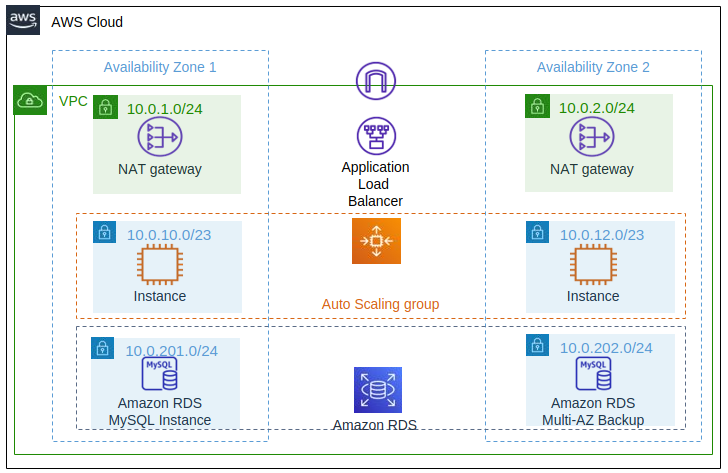

Simple Terraform AWS Example - 3 tier application with:

# Architecture
- Application Load Balancer
- Web Servers
    - Autoscaling group 
    - Launch template for EC2 Instances
- Database layer
    - RDS MySQL

The image below shows the target architecture.  

# Initial setup

## Terraform and Providers
- Terraform 0.15.0 or higher
- AWS Provider

## Variables
- variables.tf file -  some of the variables are used at later stages
- terraform.tfvars to populate variables

(up to here : tag initial_setup)

## VPC 
